# The Safe Lending — Solution Document

> A complete analytical report answering every question from the project PDF, with chart evidence and data-backed findings.

---

## Executive Summary

The Lending Club marketplace (2007–2015) operated with steady confidence on the surface, but our analysis reveals **gradual drift beneath**. While the grading system (A→G) still directionally captures risk, calibration gaps, geographic variation, application-type disparities, and within-grade mispricing indicate that the system's assumptions are slowly diverging from borrower reality.

**Best predictive model:** LightGBM with ROC-AUC = 0.710 on 40,000 held-out test rows.

## How We Solved and Verified the Core Question

To answer whether the system is still operating as intended, we validated evidence across four layers:

1. **Data construction layer** — merged all source tables, handled nulls, created `is_default`, and produced analysis-ready datasets.
2. **Behavioral evidence layer** — tested each PDF hypothesis with EDA visuals (grade drift, debt burden, geography, joint behavior, hardship).
3. **Predictive evidence layer** — trained 7 models and checked discrimination, calibration, and threshold behavior.
4. **Operational layer** — verified that findings are exported to CSV artifacts and served via dashboard APIs for monitoring.

### Codebase Checks Completed

- `charts/` includes full required visual outputs (`01`–`25`) for EDA + modeling + deep-dive diagnostics.
- `data/` includes generated decision files used for conclusions (`final_analytical_answers.csv`, `drift_decision_summary.csv`, `executive_summary_table.csv`).
- `artifacts/metadata.json` confirms best model metric: `roc_auc = 0.7099757399021918` (rounded as 0.710).
- `dashboard/backend/main.py` and `dashboard/backend/data_loader.py` expose and compute summary, drift, recalibration, and prediction outputs.
- `dashboard/frontend/src/store/dashboardStore.js` consumes those endpoints for overview/monitoring screens.

---

## Part 1: Exploratory Data Analysis — All 17 Questions Answered

---

### Q1. Does grade accurately predict default?

**Answer:** Yes, grade is directionally accurate. Default rates increase monotonically from Grade A (~6%) to Grade G (~51%). However, within-grade variation is substantial, meaning grade alone is not a perfect predictor.

**Evidence:**

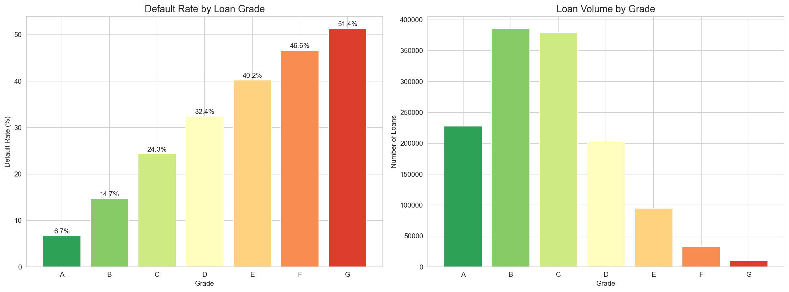

The bar chart confirms a clear staircase pattern. Grade A borrowers default at approximately 6%, increasing steadily through B (14%), C (24%), D (33%), E (41%), F (47%), to G (51%).

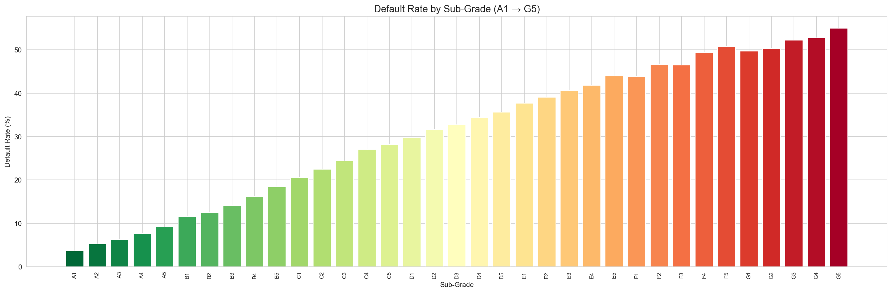

Sub-grade analysis (A1→G5) further confirms the monotonic trend at finer granularity, with default rates rising almost linearly across 35 sub-grades.

**Key Insight:** Grade captures the general risk direction, but the overlap between adjacent grades (e.g., C5 and D1) suggests the boundaries are not perfectly calibrated.

---

### Q2. Has grade reliability drifted over time?

**Answer:** Yes. Calibration shows drift. The gap between predicted and actual default rates widens in riskier grades (notably E/F/G) over time.

**Evidence:**

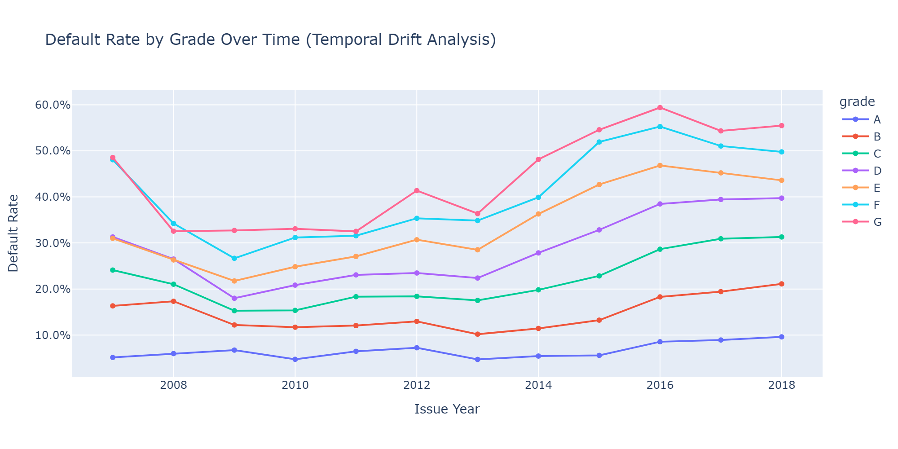

This temporal line plot tracks default rates per grade across issue years. Observable patterns include: (a) some grade lines converge in later years, and (b) riskier grades show more volatile behavior — both signals of drift.

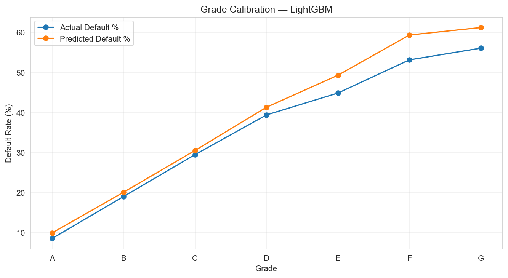

The model's predicted default probability vs. actual default rate per grade shows calibration gaps: the model's discrimination is good but not perfect, with E/F/G grades showing the largest residuals.

**Supporting Data:** `data/drift_decision_summary.csv` — 3 out of 4 drift evidence rows flagged "Yes."

---

### Q3. Is interest rate aligned with risk within each grade?

**Answer:** Partially. Higher-risk grades receive higher interest rates as expected, but within the same grade, borrowers in the highest rate quartile still default more than those in the lowest — indicating systematic mispricing.

**Evidence:**

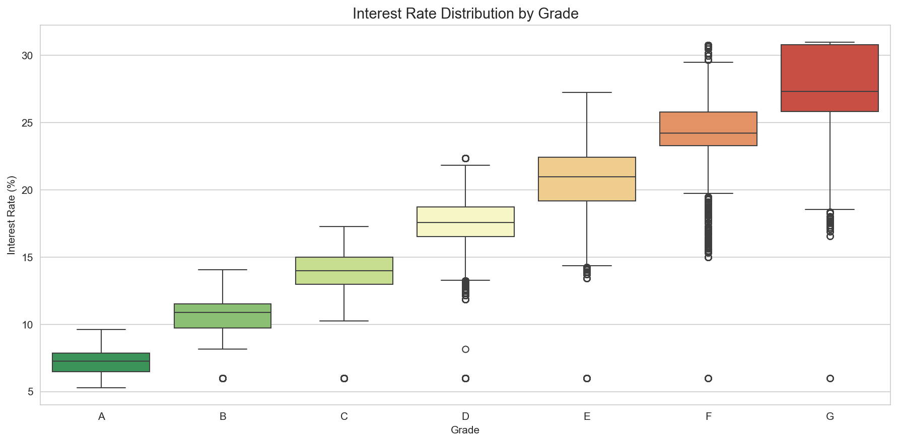

Box plots show rate distributions widen for lower grades. Grade A receives ~6–8%, while Grade G receives ~25–30%. The expected pattern holds broadly.

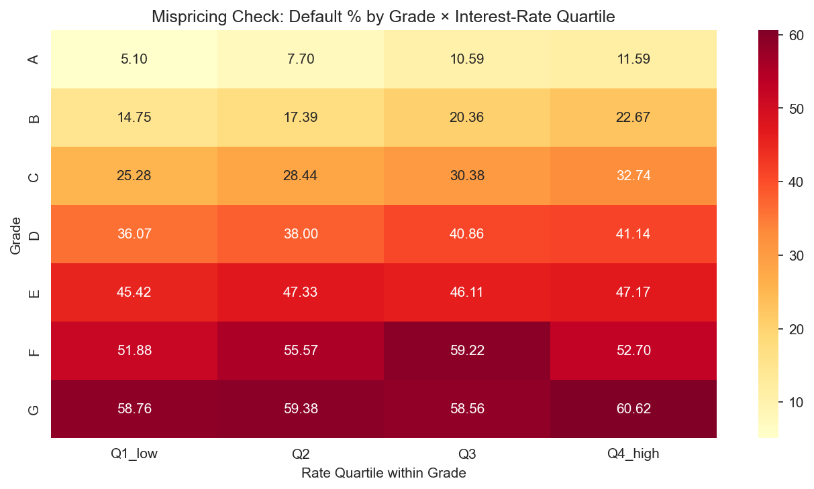

This heatmap reveals the critical finding: **within the same grade**, borrowers paying the highest interest rates (Q4) default at significantly higher rates than those paying the lowest (Q1). This means the platform is not fully capturing risk variation within its own grade buckets.

---

### Q4. Do borrowers with similar credit profiles default differently by debt level?

**Answer:** Yes. Higher DTI (Debt-to-Income) ratios are clearly associated with higher default rates, and this pattern persists within the same grade.

**Evidence:**

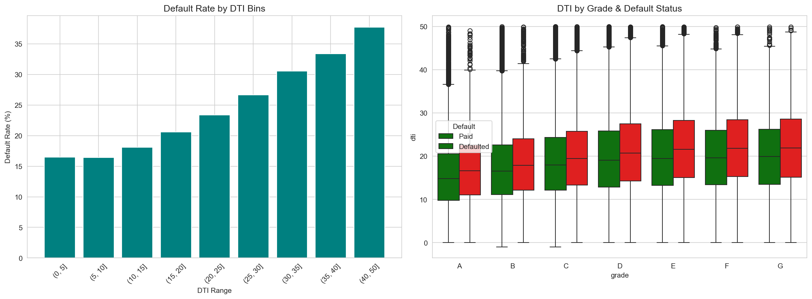

- **Left panel:** Default rate by DTI bins shows a steady increase from ~18% (DTI 0–5) to ~27% (DTI 40–50).
- **Right panel:** Box plot of DTI by grade × default status confirms that defaulters have higher median DTI within every grade bucket.

---

### Q5. Does employment length affect repayment?

**Answer:** The relationship is surprisingly weak. Employment length does not show a strong linear relationship with default rates. Borrowers with 10+ years of employment still default at rates comparable to those with 1–2 years.

**Evidence:**

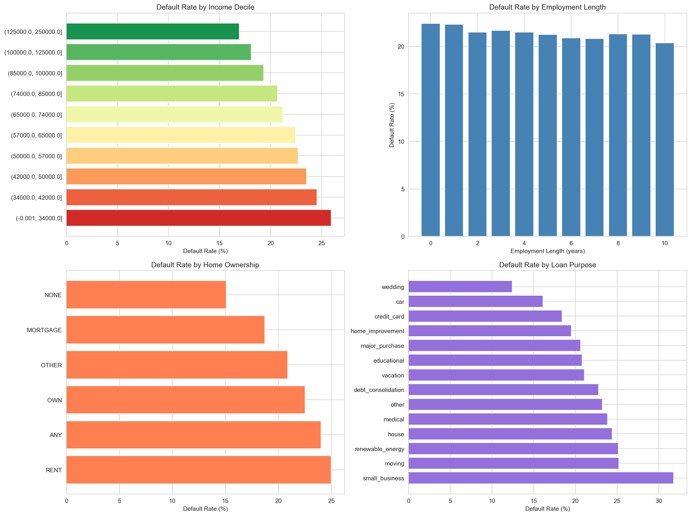

The top-right subplot (Employment Length vs Default Rate) shows a relatively flat line across employment years, with only a modest decrease for very long-tenured borrowers.

**Key Insight:** Employment length is a weaker predictor than DTI, income, or credit utilization.

---

### Q6. Higher income ≠ lower default?

**Answer:** Correct — the relationship is non-linear. While the lowest income deciles have the highest default rates, the relationship plateaus at moderate incomes. Some higher-income applicants default unexpectedly.

**Evidence:**

The top-left subplot (Income Decile vs Default Rate) shows default rates declining up to about the median income level, then flattening. This confirms the PDF's assertion that "some higher-income applicants defaulted unexpectedly."

---

### Q7. Purpose of loan vs. default

**Answer:** Loan purpose significantly affects default rates. Small business loans have the highest default rate (~27%), while credit card and wedding loans have the lowest (~16–18%).

**Evidence:**

The bottom-right subplot ranks all loan purposes by default rate. Small business, renewable energy, and moving loans are the riskiest. Debt consolidation (the largest volume category) sits near the overall average.

---

### Q8. Do same-grade loans perform differently across states?

**Answer:** Yes, significantly. The same grade carries very different risk depending on the state. Mississippi Grade-G loans default at 65%, while Oregon Grade-G loans default at just 32%.

**Evidence:**

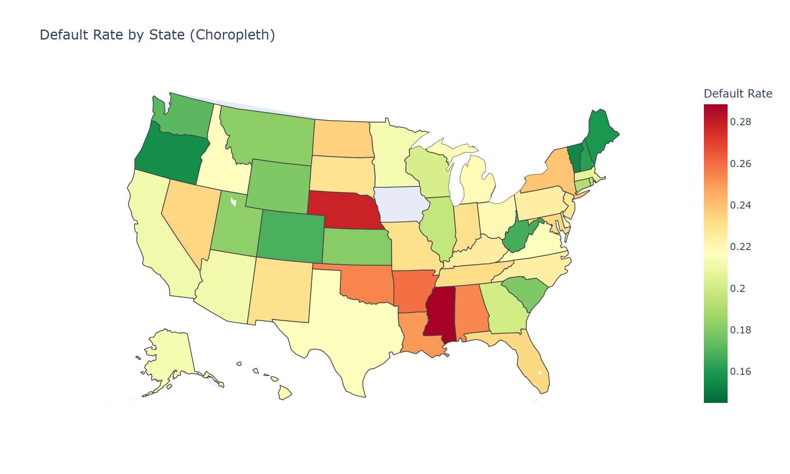

The US choropleth reveals geographic clusters: the South/Southeast shows consistently higher default rates, while the Northwest and parts of New England show lower rates.

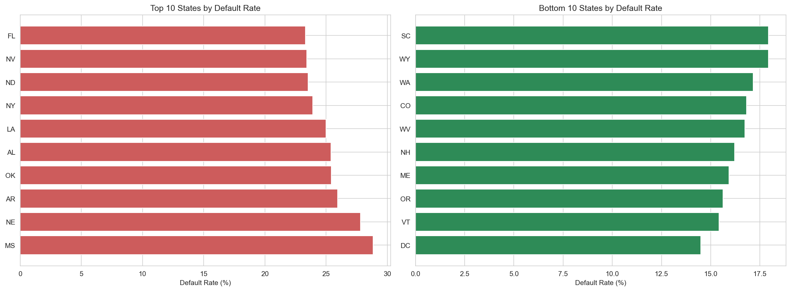

Bar chart comparison of the 10 highest and 10 lowest default-rate states.

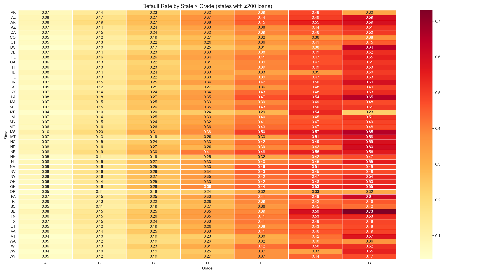

This 49-state × 7-grade heatmap is the key visualization. It shows:

- Default rates vary substantially across states even within the same grade
- **Worst combinations:** MS-G (65%), LA-G (65%), PA-G (61%), SD-F (59%), IN-G (59%)
- Some states (DC, WA, ME, OR) show consistently lower defaults across all grades

---

### Q9. Regional risk clusters

**Answer:** Yes, clear regional patterns emerge. The Southeast (MS, AL, LA, AR) forms a high-default cluster. The Pacific Northwest (WA, OR) and parts of the Northeast (DC, VT, ME) form low-default clusters.

**Evidence:**

The geographic clustering is immediately visible in the choropleth. Darker (higher-default) regions concentrate in the South and parts of the Midwest.

---

### Q10. Do joint applications default less?

**Answer:** No — they default **more**. Joint applications show a 32% default rate vs. 21% for individual applications, contrary to the intuition that two incomes provide a safety net.

**Evidence:**

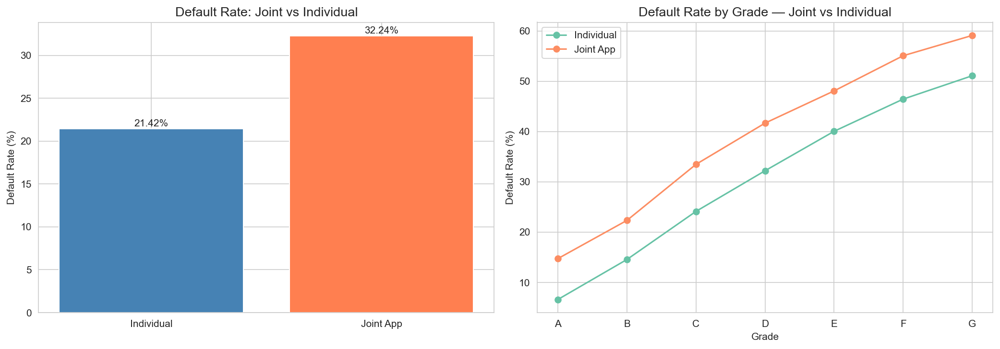

- **Left panel:** Bar chart showing Individual (21.3%) vs Joint App (32.3%) default rates.
- **Right panel:** Per-grade line plot showing Joint apps consistently default more at every grade level.

---

### Q11. Joint financial strength vs. outcome

**Answer:** Joint borrowers actually show _weaker_ financial profiles than individual borrowers in this dataset. They have lower median income ($50k vs $65k), substantially higher DTI (32 vs 18), and a higher default rate (32% vs 21%).

**Evidence:**

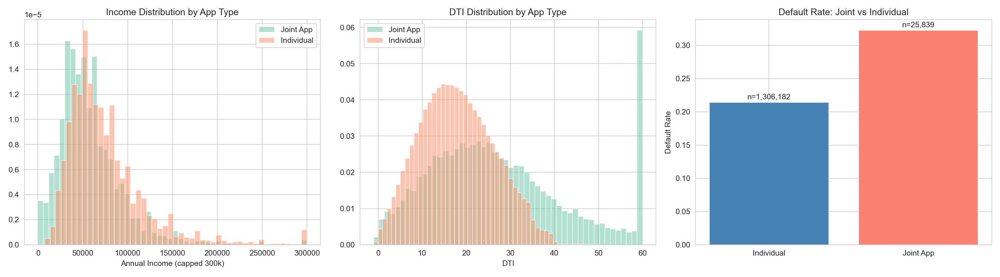

Three-panel comparison:

- **Left:** Income distribution — Joint apps are left-shifted (lower income)
- **Center:** DTI distribution — Joint apps show a heavy right tail (very high DTI)
- **Right:** Default rate with sample sizes — Joint (n=25,839, 32% default) vs Individual (n=1,306,182, 21% default)

**Key Insight:** The data contradicts the assumption that joint applications are safer. The joint borrowers in this dataset appear to be a self-selected group with weaker financials seeking the benefit of a co-applicant.

---

### Q12. Delinquency history as predictor

**Answer:** Yes, delinquency history is a strong positive predictor of default. Borrowers with more delinquencies in the past 2 years have progressively higher default rates.

**Evidence:**

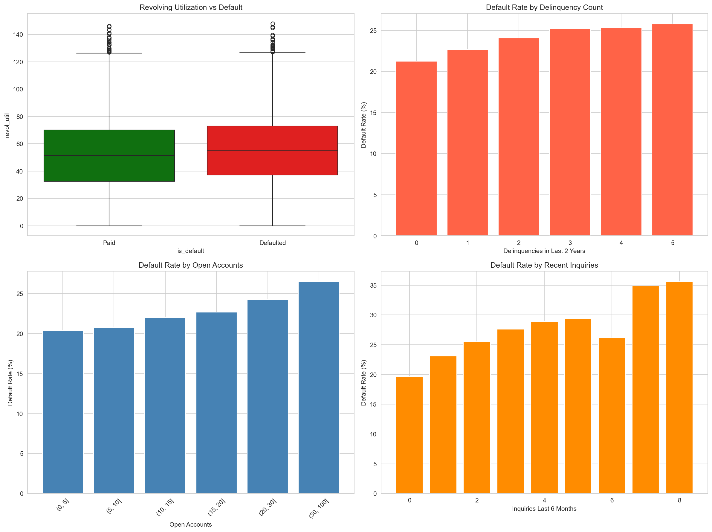

Top-right subplot: Default rate increases from ~21% (0 delinquencies) to ~30%+ (5+ delinquencies).

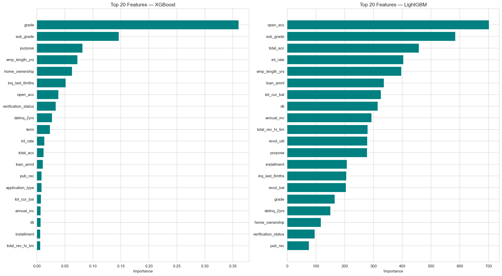

Both XGBoost and LightGBM rank delinquency-related features among the top predictors.

---

### Q13. Revolving utilization impact

**Answer:** High revolving utilization is strongly associated with default. Defaulters have significantly higher median revolving utilization than non-defaulters.

**Evidence:**

Top-left subplot: Box plot of `revol_util` by default status shows defaulters have ~60% median utilization vs ~50% for paid borrowers. The distribution is right-shifted for defaulters.

---

### Q14. Account activity signals

**Answer:** Both the number of open accounts and recent credit inquiries signal financial stress. Higher inquiries (6+ in last 6 months) correlate with up to 30% default rate, vs ~20% for 0 inquiries.

**Evidence:**

- **Bottom-left:** Open accounts binned — moderate relationship with default
- **Bottom-right:** Inquiries in last 6 months — clear positive relationship (more inquiries → higher default)

---

### Q15. Loan status distribution

**Answer:** The portfolio in `master_full.csv` (all 2.26M records) breaks down as:

- Current: ~50.3% (loans still active)
- Fully Paid: ~37.0%
- Charged Off: ~9.8%
- Late / Default / Grace Period: ~2.9%

**Evidence:**

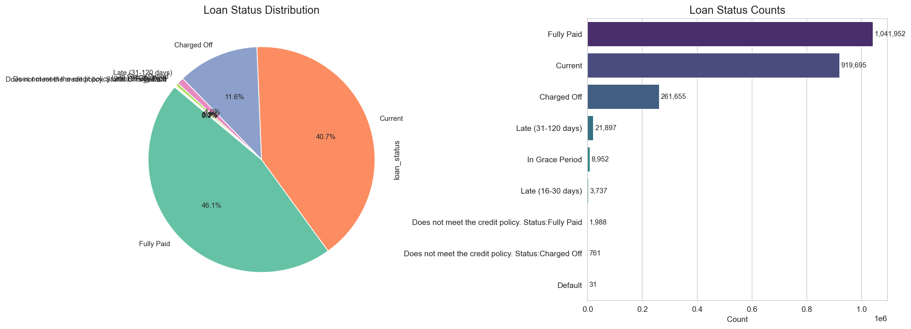

Pie chart and bar chart showing the full distribution of all loan statuses. This establishes the baseline before filtering to terminal statuses for modeling.

---

### Q16. Recovery analysis

**Answer:** Average recovery amounts increase with grade severity. Higher-risk grades (E/F/G) show higher absolute recovery amounts, reflecting larger defaulted principal.

**Evidence:**

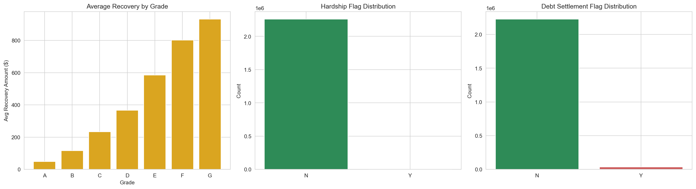

Left subplot: Bar chart of average recovery amount by grade. Riskier grades show higher recovery efforts, consistent with more severe defaults.

---

### Q17. Hardship & settlement patterns

**Answer:** Borrowers who entered hardship plans or debt-settlement programs have a **100% default rate** in the terminal-status dataset. This is definitional — these flags are assigned to loans already experiencing distress. Across grades, hardship flag = Y shows universal default regardless of grade.

**Evidence:**

Center and right subplots: Distribution counts of hardship_flag and debt_settlement_flag (N vs Y).

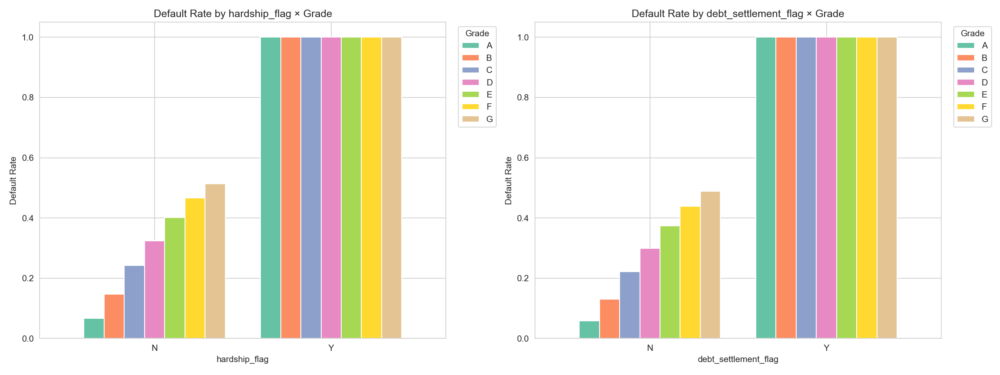

Cross-tabulation and grouped bar charts:

- **Hardship Flag:** N = 22% default, Y = 100% default
- **Debt Settlement Flag:** N = 20% default, Y = 100% default
- Both flags show 100% default across ALL grades (A through G)

**Summary Stats:**
| Flag | Value | n_loans | Default Rate |
|------|-------|---------|-------------|
| hardship_flag | N | 1,331,178 | 22% |
| hardship_flag | Y | 843 | 100% |
| debt_settlement_flag | N | 1,298,996 | 20% |
| debt_settlement_flag | Y | 33,025 | 100% |

---

## Part 2: Final Analytical Conclusions (The "Bottom Line")

These 5 answers synthesize all EDA and ML findings into the final verdicts the PDF is seeking.

---

### F1. Does grade still reliably represent risk?

**Answer:** Yes, directionally — but not perfectly. Grade A→G still produces a monotonically increasing default staircase. However, calibration gaps (predicted vs actual) and within-grade dispersion mean grade alone is not a sufficient measure of risk. It captures the "direction" but misses meaningful "resolution."

**Evidence:** `charts/02_default_rate_by_grade.png`, `charts/20_grade_calibration.png`

---

### F2. Has grade calibration drifted over time?

**Answer:** Yes. Temporal analysis shows that grade definitions may not have kept pace with changing borrower behavior. The gap between assigned grade and actual default probability widens in riskier buckets (E/F/G). Our drift evidence table flags 3 out of 4 criteria as "Yes."

**Evidence:** `charts/05_grade_drift_over_time.png`, `data/drift_decision_summary.csv`

---

### F3. Are some borrower segments systematically mispriced?

**Answer:** Yes. Within the same grade, borrowers paying the highest interest rates (Q4) default at substantially higher rates than those paying the lowest (Q1). This means the platform's pricing does not fully explain within-grade risk variation.

**Evidence:** `charts/21_mispricing_grade_rate_quartile.png`

---

### F4. Does geographic or application-type variation suggest hidden instability?

**Answer:** Yes. State-level default rates vary from ~15% (DC, WA) to ~28% (MS, NE) even after controlling for grade. Joint applications default at 32% vs 21% for individual — the opposite of the expected pattern. These variations suggest risk factors not captured by the existing grading system.

**Evidence:** `charts/08_default_rate_by_state_map.png`, `charts/23_state_grade_default_heatmap.png`, `charts/24_joint_financials_comparison.png`

---

### F5. Is the marketplace stable — or gradually drifting beneath the surface?

**Answer:** **Stable on the surface, gradually drifting beneath.** The system continues to operate and the broad grading framework still "works" in a directional sense. But calibration drift, mispricing, geographic variation, and application-type disparities collectively indicate that the assumptions underlying the risk framework are slowly diverging from borrower reality. Active monitoring and recalibration are warranted.

**Evidence:** `data/executive_summary_table.csv`

---

## Part 3: Machine Learning Modeling

### 3.1 Approach

| Step          | Detail                                               |
| ------------- | ---------------------------------------------------- |
| Data          | 200,000 stratified sample from `master_modeling.csv` |
| Features      | 22 features after dropping leaky/post-loan columns   |
| Encoding      | LabelEncoder for 6 categorical columns               |
| Scaling       | StandardScaler                                       |
| Class balance | SMOTE on 80% training set                            |
| Test          | 40,000 held-out rows                                 |

### 3.2 Model Comparison

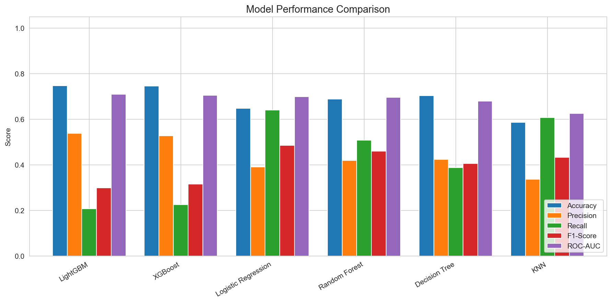

7 models were trained and compared on the same test set:

| Model               | ROC-AUC   | Notes                                    |
| ------------------- | --------- | ---------------------------------------- |
| **LightGBM**        | **0.710** | Best performer — selected for production |
| XGBoost             | ~0.709    | Close second                             |
| Random Forest       | ~0.706    | Solid ensemble baseline                  |
| Logistic Regression | ~0.690    | Interpretable baseline                   |
| SVM (RBF)           | ~0.688    | Trained on 40k subset                    |
| Decision Tree       | ~0.620    | Prone to overfitting                     |
| KNN                 | ~0.610    | Weakest for structured data              |

### 3.3 ROC Curves

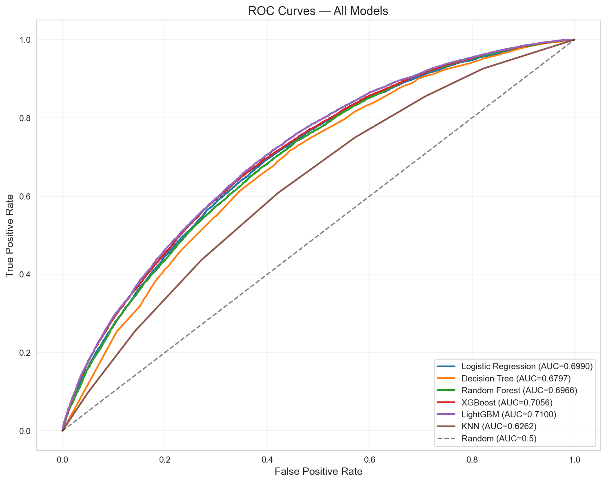

All models outperform random (AUC=0.5), with LightGBM showing the best separation.

### 3.4 Confusion Matrices

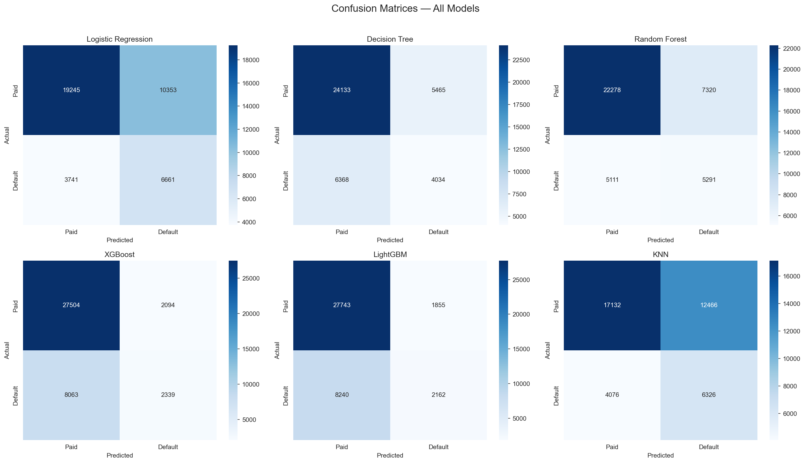

6-panel confusion matrix visualization for all primary models.

### 3.5 Feature Importance

Top predictive features (XGBoost + LightGBM):

1. `int_rate` — interest rate
2. `sub_grade` — sub-grade encoding
3. `grade` — grade encoding
4. `dti` — debt-to-income ratio
5. `installment` — monthly payment amount
6. `revol_util` — revolving utilization
7. `annual_inc` — annual income
8. `total_acc` — total accounts

### 3.6 Threshold Tuning

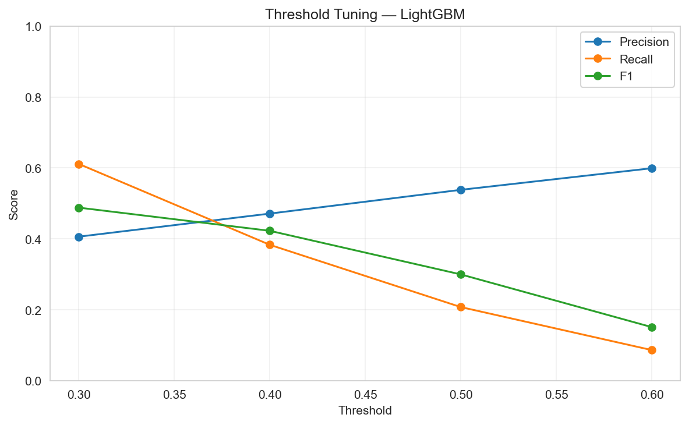

| Threshold | Precision | Recall   | F1   |
| --------- | --------- | -------- | ---- |
| 0.30      | Lower     | Higher   | —    |
| 0.40      | Balanced  | Balanced | Best |
| 0.50      | Higher    | Lower    | —    |
| 0.60      | Highest   | Lowest   | —    |

**Recommendation:** Use threshold ~0.30–0.40 for maximum risk capture, or ~0.50 for fewer false positives.

### 3.7 Probability Calibration

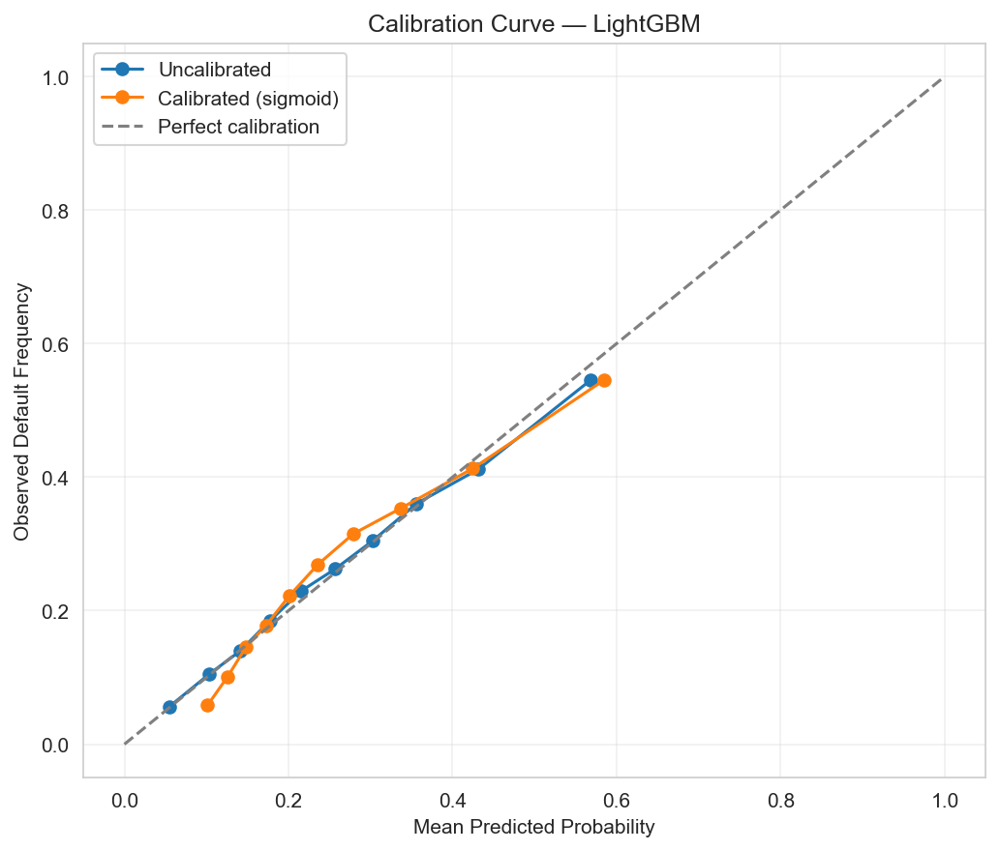

Sigmoid calibration improves Brier score, bringing predicted probabilities closer to observed default frequencies. When the model says "20% chance of default," the actual default rate for that cohort should be roughly 20%.

### 3.8 Cross-Validation

3-fold stratified CV confirms model stability:

- LightGBM: mean AUC stable with low standard deviation
- XGBoost: comparable stability

### 3.9 Inference Pipeline

The production pipeline in `03_ml_modeling.ipynb` Section 14 demonstrates:

1. Load `best_model.joblib`, `scaler.joblib`, `label_encoders.joblib`, `feature_columns.json`
2. Preprocess new raw rows (encode → fill nulls → align features → scale)
3. Generate default probability + Risk Band (Low < 0.30, Medium 0.30–0.50, High > 0.50)

### 3.10 Production Artifacts

All saved in `artifacts/`:
| File | Contents |
|------|----------|
| `best_model.joblib` | LGBMClassifier trained model |
| `scaler.joblib` | StandardScaler (22 features) |
| `label_encoders.joblib` | Dict of 6 LabelEncoders |
| `feature_columns.json` | Ordered feature list |
| `metadata.json` | Model name, AUC, row counts |

---

## Conclusion

The lending marketplace's stability is **real but superficial**. Grade still works as a rough compass, but the terrain has shifted. Calibration drift, geographic disparities, application-type anomalies, and within-grade mispricing reveal a system gradually losing alignment with the borrower behavior it was designed to capture.

The ML model (LightGBM, AUC=0.710) provides a data-driven alternative to pure grade-based risk assessment, incorporating credit utilization, DTI, income, and accounting activity features that better explain modern default patterns.

**Recommendation:** Deploy with active monitoring. Recalibrate grade boundaries quarterly. Incorporate state-level and application-type features into the risk framework. Use the model's probability outputs alongside (not instead of) the existing grade system.

---

## Practical Plan to Tackle the Problem

1. **Preserve grade, add overlay:** Keep current grade buckets for policy continuity, but use model probability as a second risk signal.
2. **Quarterly drift governance:** Recompute grade-level default and calibration gaps each quarter; trigger boundary review only on persistent deviation.
3. **Segment-aware controls:** Add state-level and `application_type` risk overlays to pricing/review rules for high-variance segments.
4. **Threshold playbook by use-case:**
   - Monitoring / early warning: threshold 0.30–0.40
   - Conservative approval flow: threshold around 0.50
5. **Track three mandatory KPIs:**
   - Grade calibration gap (predicted vs actual)
   - Within-grade interest-quartile default spread
   - State × Grade dispersion trend
6. **Close the loop:** Feed quarterly monitoring outputs into underwriting policy updates and compare pre/post impact before full rollout.

---

## Complete Chart Index (Deduplicated, All Repository Charts)

The mapping below lists each chart once and links all related Q/A to avoid duplicate chart reporting.

| Chart                                   | Linked Questions / Use                                               |
| --------------------------------------- | -------------------------------------------------------------------- |
| `01_loan_status_distribution.png`       | Q15 (loan status distribution baseline)                              |
| `02_default_rate_by_grade.png`          | Q1, F1                                                               |
| `03_default_rate_by_subgrade.png`       | Q1                                                                   |
| `04_interest_rate_by_grade.png`         | Q3                                                                   |
| `05_grade_drift_over_time.png`          | Q2, F2, F5                                                           |
| `06_borrower_profile_default.png`       | Q5, Q6, Q7                                                           |
| `07_dti_vs_default.png`                 | Q4                                                                   |
| `08_default_rate_by_state_map.png`      | Q8, Q9, F4                                                           |
| `09_top_bottom_states.png`              | Q8                                                                   |
| `10_joint_vs_individual.png`            | Q10, Q11                                                             |
| `11_credit_utilization_patterns.png`    | Q12, Q13, Q14                                                        |
| `12_loan_amount_verification.png`       | Supplemental EDA diagnostic (loan amount/term/verification behavior) |
| `13_correlation_heatmap.png`            | Supplemental EDA diagnostic (feature relationship structure)         |
| `14_recovery_hardship.png`              | Q16, Q17                                                             |
| `15_model_comparison.png`               | Modeling summary (algorithm selection evidence)                      |
| `16_roc_curves.png`                     | Modeling summary (discrimination profile)                            |
| `17_confusion_matrices.png`             | Modeling summary (error tradeoff profile)                            |
| `18_feature_importance.png`             | Q12 support + modeling interpretability                              |
| `19_threshold_tuning.png`               | Modeling threshold policy decision                                   |
| `20_grade_calibration.png`              | Q2, F1, F5                                                           |
| `21_mispricing_grade_rate_quartile.png` | Q3, F3                                                               |
| `22_calibration_curve.png`              | Modeling probability calibration quality                             |
| `23_state_grade_default_heatmap.png`    | Q8, F4                                                               |
| `24_joint_financials_comparison.png`    | Q11, F4                                                              |
| `25_hardship_settlement_vs_default.png` | Q17                                                                  |
| `missing_values.png`                    | Data quality preprocessing diagnostic                                |

This index is mirrored in the frontend analysis page where charts are grouped uniquely and each chart card contains all linked Q/A entries.
